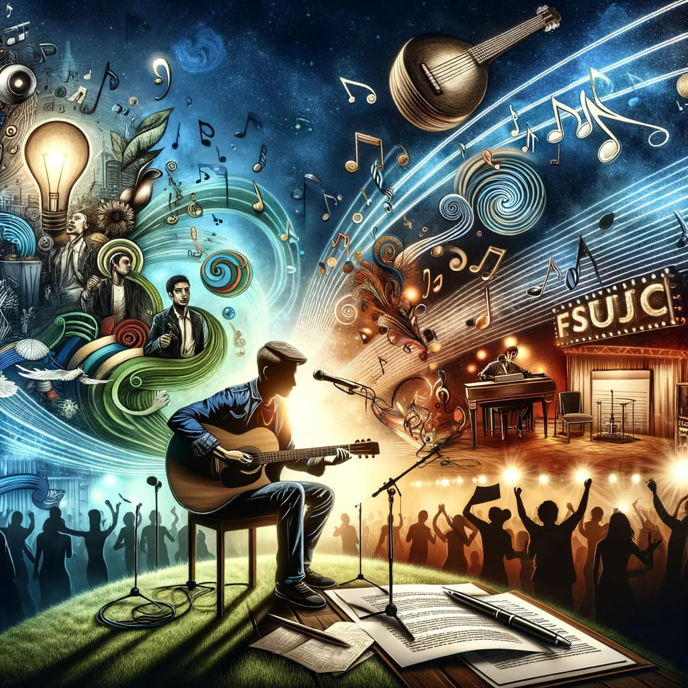

La verdadera belleza de la inteligencia artificial radica en su capacidad para aprender, adaptarse y mejorar con el tiempo. A través del aprendizaje automático y el procesamiento de grandes volúmenes de datos, la AI puede identificar patrones y soluciones que a menudo escapan a la capacidad de análisis humana. Esto no solo acelera el ritmo de la innovación sino que también abre nuevas fronteras en campos como la medicina, la educación, el transporte y la sostenibilidad ambiental.

